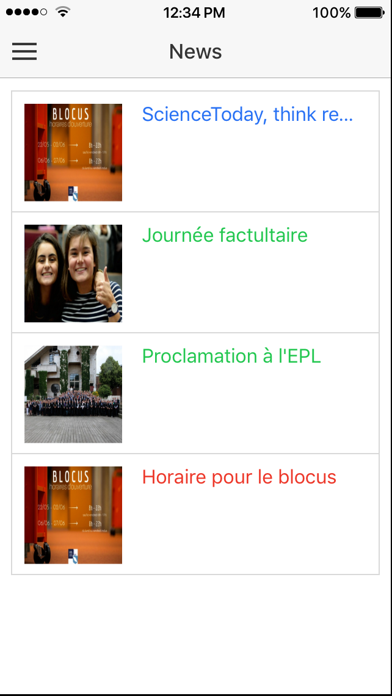
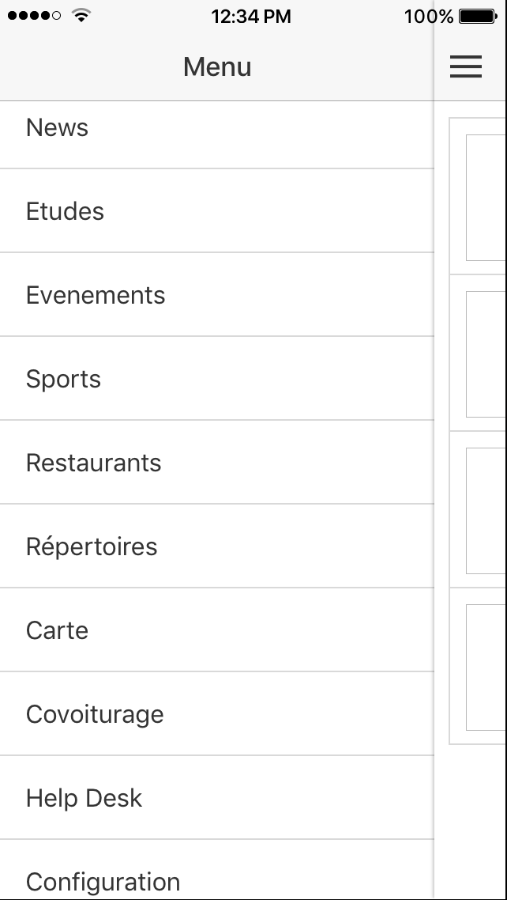
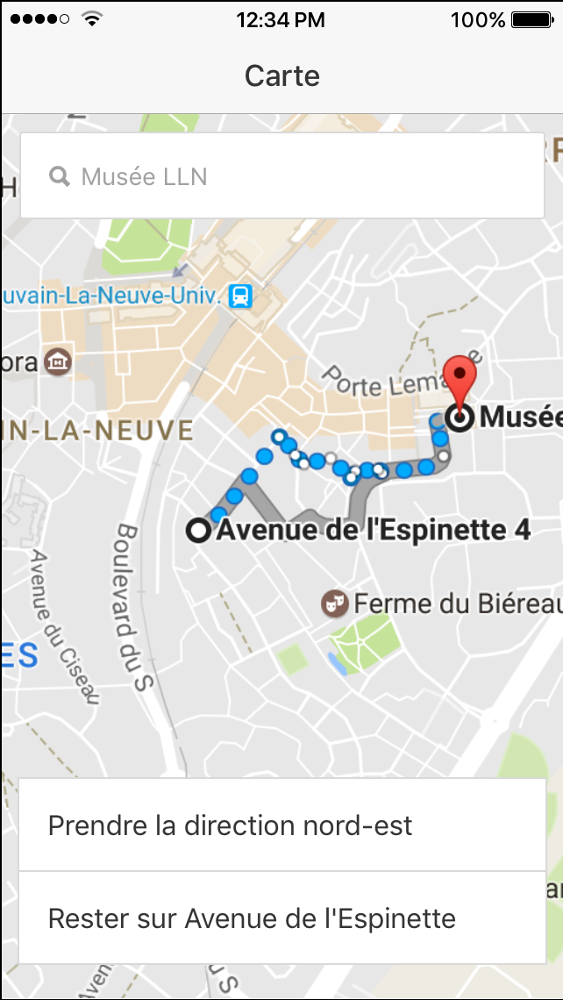
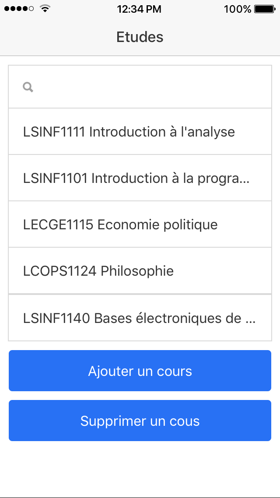
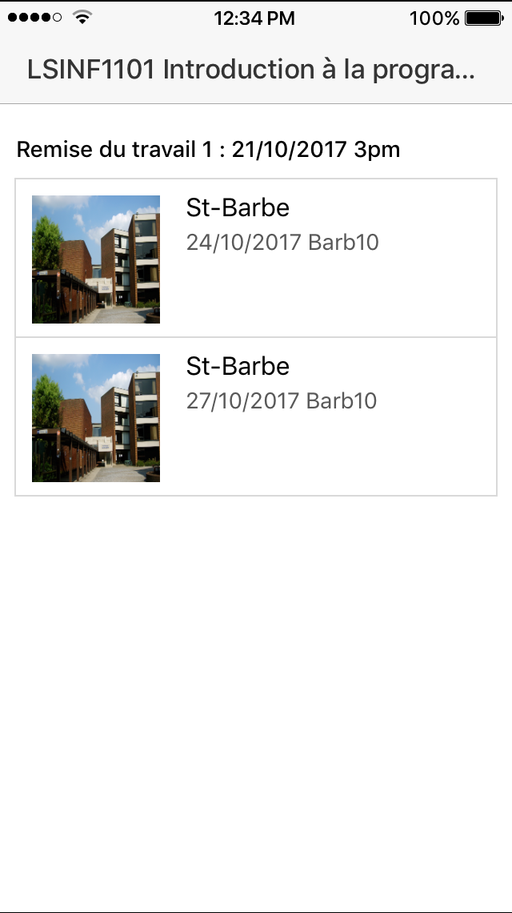

# UCLCampus
UCLcampus is an application designed to accompany UCL students in their daily life on campus. Contributions are welcome for any good feature.

[](https://gitter.im/UCLCampus/Lobby?utm_source=badge&utm_medium=badge&utm_campaign=pr-badge&utm_content=badge)

## Prerequisites
- Download nodejs from https://nodejs.org/en/download/current/ It will install `node` and `npm`
```bash
node -v
 - should be >= 6.0.0
npm -v
 - should be >= 3.0.0
```
- For iOS, update XCode version to 8.0 or higher

- Get Google Maps API keys :
    * Go to Google Console : https://console.developers.google.com/flows/enableapi?apiid=maps\_backend,geocoding\_backend,directions\_backend,distance\_matrix\_backend,elevation\_backend,places\_backend&reusekey=true
    * Select or create a project
    * Click on continue to activate the API
    * Once you are on page Credentials, select the Javascript API. Click on the blue button to create the key.
    * Click on the library button on the left pane
    * Select Google Maps Android and then enable the service, repeat this step for Google Maps iOS
    * Click on credentials on the left pane, create two more api keys (one for Android, one for iOS
    * Click on each new key to restrict it's access (Android restriction, iOS restriction, HTTP referent restriction)

## Getting Started

* Clone this repository

* Install Ionic, cordova
    ```bash
    $ npm install -g ionic cordova
    ```
* or update Ionic
    ```bash
    $ npm uninstall -g ionic cordova
    $ npm install -g ionic cordova
    ```
    
* Replace the values of "myapikeyforandroid" and "myapikeyforios" by the keys you created in the Google Console, in the file UCLCampus/config.xml
    
    ```xml
    <plugin name="cordova-plugin-googlemaps" spec="~1.4.0">
      <variable name="API_KEY_FOR_ANDROID" value="myapikeyforandroid" />
      <variable name="API_KEY_FOR_IOS" value="myapikeyforios" />
    </plugin>
    ```

* Replace the value of "myapikey" by your Javascript key in the file UCLCampus/src/providers/map-service.ts (line 46)

* Prepare the cordova build : 
    ```bash
    $ cordova prepare
    ```
    
* Install node_modules
    ```bash
    $ npm install
    ```
## Run

### Browser
```bash
$ ionic serve
```

### Android

```bash
$ ionic cordova platform add android
$ ionic cordova run android
```

### iOS
```bash
$ ionic cordova platform add ios
$ ionic cordova build ios
```

## Tests

### Unit Tests : Karma
To run the unit tests
```bash
$ npm test
```
### E2E Tests : Protractor
To run the E2E tests
```bash
$ ionic serve
$ npm run e2e
```
## Features

### Existing Features

* Display event of CarpeStudentem
* Launch carpooling app https://www.commuty.net
* Launch Resto4u app
* Help Desk, How to connect to the university network
* Maps with point of interest on campus

### Future Features

* Display News of UCL
* Display course schedule (ADE)
* Add course schedule to your calendar
* Display Libraries schedule and more informations
* Authentication with OAuth 2.0
* Studentbook and Staffbook
* Display Sports schedule

## Screenshots




 

## User Guide


## Contribution
Contributions are welcome!

* Report issues
* Open pull request with improvements
* Spread the word

### Developper Guide


## License
UCLCampus is available under the GNU/GPLv3 license. See the LICENSE file for more info.
